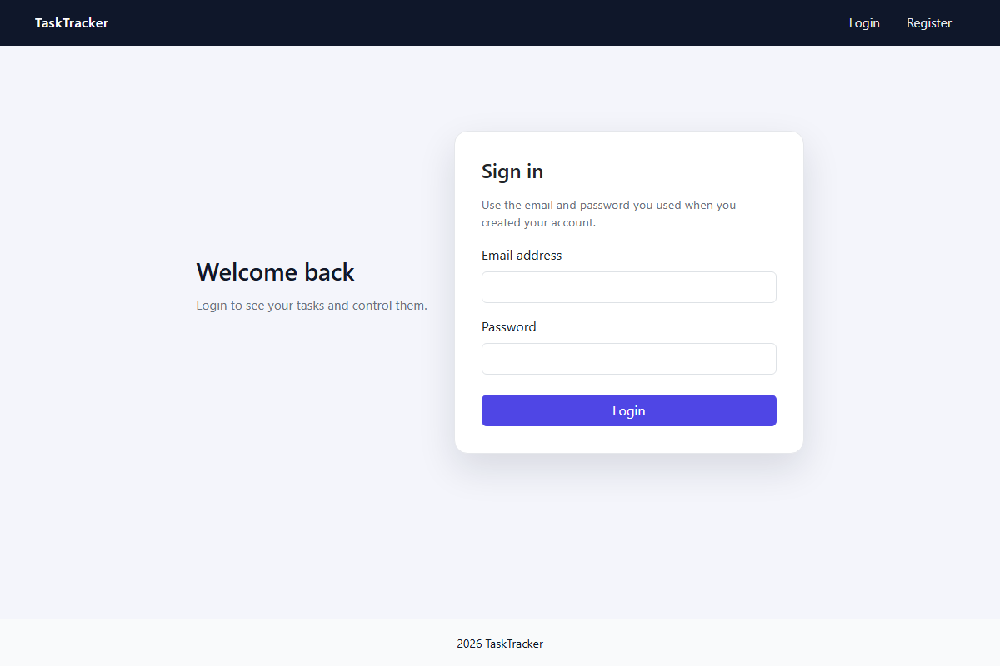
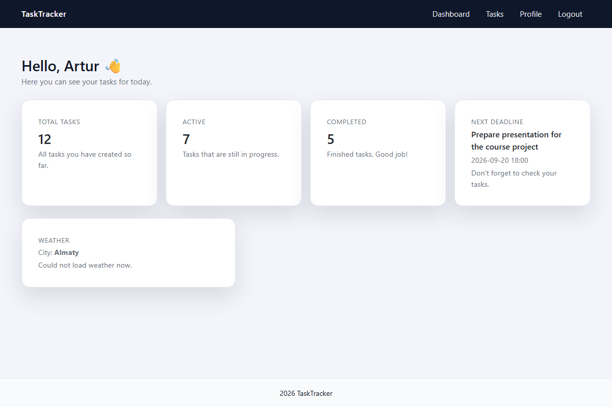
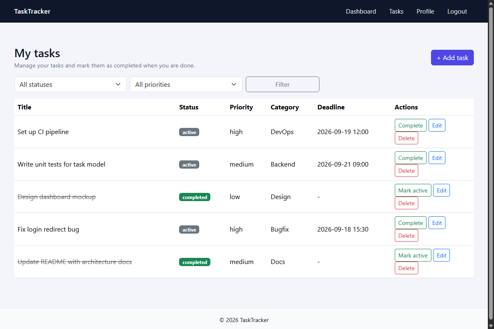
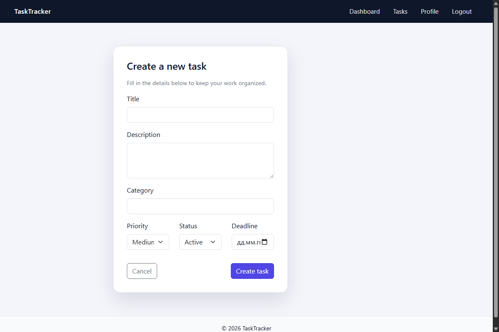
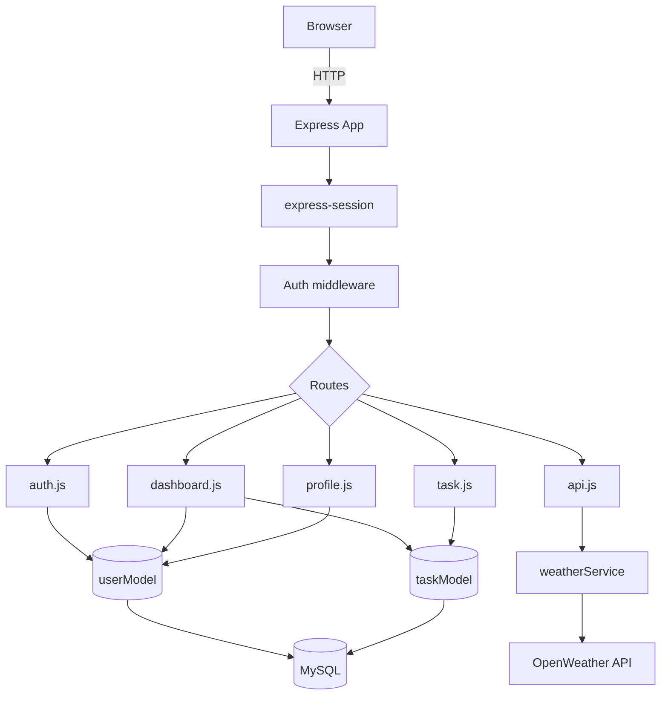

<h1 align="center">Task Tracker</h1>

<p align="center">
A small server-rendered task manager: register, log in, create tasks with priority/status/deadline, filter them, and check a weather widget for your city on the dashboard.
</p>

<p align="center">


</p>

<p align="center">
  <a href="#features">Features</a> ·
  <a href="#screenshots">Screenshots</a> ·
  <a href="#getting-started">Getting started</a> ·
  <a href="docs/ARCHITECTURE.md">Architecture</a> ·
  <a href="docs/API.md">API</a> ·
  <a href="docs/CONTRIBUTING.md">Contributing</a>
</p>

---

## Screenshots

<table>
  <tr>
    <td></td>
    <td></td>
  </tr>
  <tr>
    <td align="center"><sub>Login</sub></td>
    <td align="center"><sub>Dashboard with stats & weather</sub></td>
  </tr>
  <tr>
    <td></td>
    <td></td>
  </tr>
  <tr>
    <td align="center"><sub>Task list with filters</sub></td>
    <td align="center"><sub>Create / edit task</sub></td>
  </tr>
</table>

---

## Features

- Email + password authentication (`bcryptjs` hashing, session-based)
- Create, edit, delete and filter tasks by status and priority
- Toggle a task between `active` and `completed` with one click
- Per-user profile (name, city) — city drives the dashboard weather widget
- Live weather for your city via the OpenWeather API, loaded client-side with a graceful fallback if the key/city is missing
- Server-rendered pages (EJS) with a small Bootstrap-based UI, no build step

## How it works



Full breakdown of layers, the auth sequence, task lifecycle and DB schema lives in **[docs/ARCHITECTURE.md](docs/ARCHITECTURE.md)**.

---

## Getting started

### Prerequisites

- Node.js and npm
- A running MySQL server
- An [OpenWeather](https://openweathermap.org/api) API key (free tier works) if you want the weather widget to actually return data

### Installation

```bash
git clone https://github.com/arturrw/Task-Tracker.git
cd Task-Tracker
npm install
```

### Database setup

Log in to MySQL as a user allowed to create databases/users, then run the provided schema:

```bash
mysql -u root -p < sql/schema.sql
```

This creates the `task_tracker_db` database, a `tt_user` MySQL user, and the `users`/`tasks` tables.

> The schema ships with a placeholder password (`strong_password_here`) for `tt_user`. Change it in `sql/schema.sql` before running it, and use the same value in `.env`.

### Environment variables

Copy the example file and fill in your own values:

```bash
cp .env.example .env
```

| Variable | Description |
|---|---|
| `PORT` | Port the server listens on (default `3000`) |
| `DB_HOST`, `DB_USER`, `DB_PASSWORD`, `DB_NAME` | MySQL connection details |
| `SESSION_SECRET` | Random string used to sign the session cookie |
| `WEATHER_API_KEY` | Your OpenWeather API key |
| `WEATHER_API_BASE_URL` | OpenWeather endpoint (defaults to the current-weather API) |

`.env` is git-ignored — never commit real secrets in it.

### Running

```bash
npm start
```

Then open [http://localhost:3000](http://localhost:3000). You'll be redirected to `/login` until you register an account.

---

## API

The app is mostly server-rendered pages, plus one JSON endpoint (`GET /api/weather`) used by the dashboard. Full request/response shapes and the full route table are in **[docs/API.md](docs/API.md)**.

## Contributing

Bug reports, small fixes and feature ideas are welcome. See **[docs/CONTRIBUTING.md](docs/CONTRIBUTING.md)** for branch naming, code style and how to test your change locally before opening a PR.

## License

[MIT](LICENSE) © arturrw
