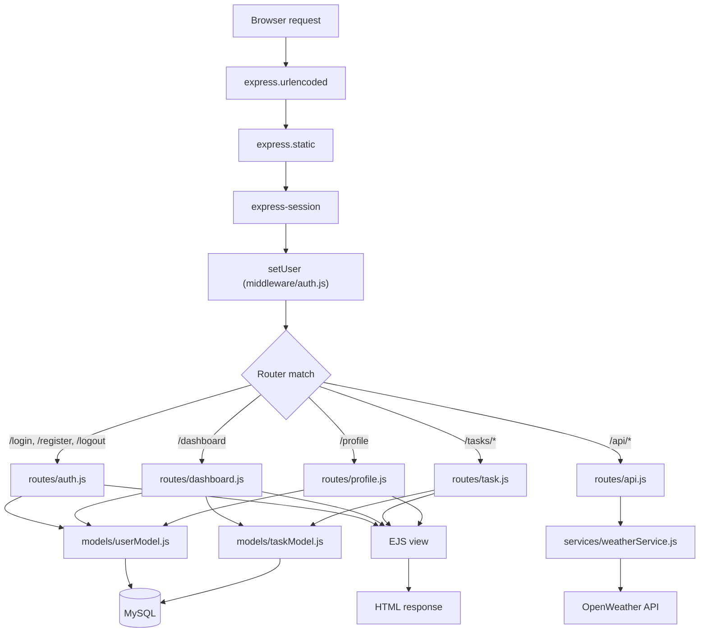
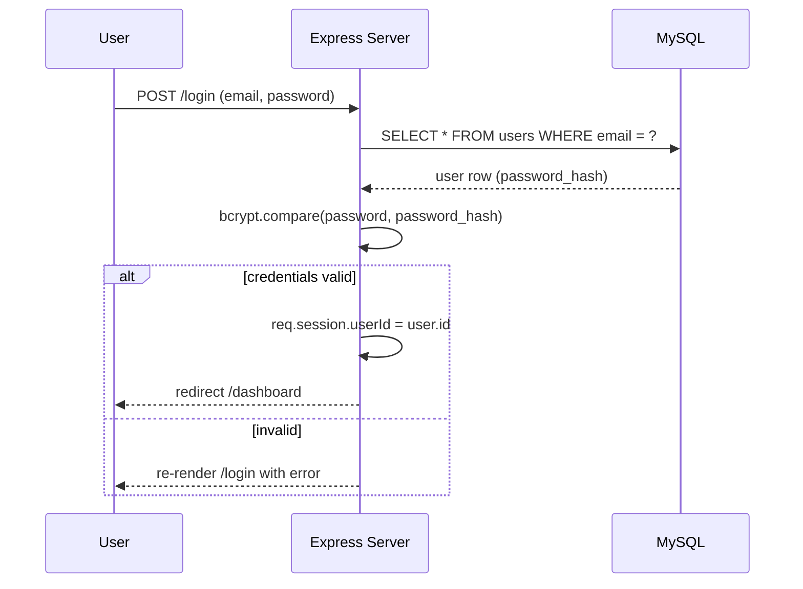
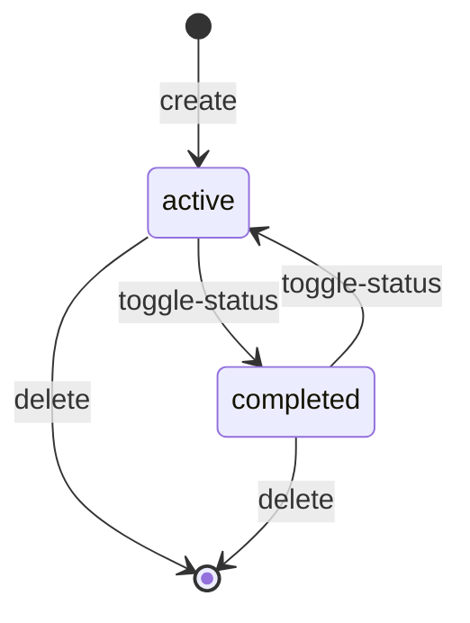
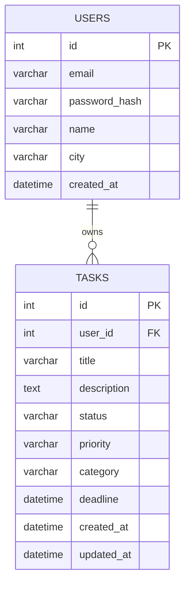

# Architecture

Task Tracker is a small server-rendered web app built with **Express** and **EJS**. There is no frontend framework and no client-side build step — the server renders full HTML pages, and a couple of small vanilla-JS scripts handle progressive enhancement (like the weather widget).

## Layered structure

The codebase follows a simple layered structure, similar to a lightweight MVC:

| Layer | Folder | Responsibility |
|---|---|---|
| Entry point | `server.js` | Wires up Express, sessions, static files and routers |
| Routes (controllers) | `routes/` | Parse requests, call models/services, render views or redirect |
| Middleware | `middleware/` | Cross-cutting concerns: auth guard, exposing the current user to views |
| Models | `models/` | All SQL access lives here — routes never talk to the database directly |
| Services | `services/` | Integrations with external APIs (currently OpenWeather) |
| Views | `views/` | EJS templates, one per page |
| Config | `config/` | Database connection pool |
| Public | `public/` | Static assets served as-is (CSS, client-side JS) |

```text
task-tracker/
├── server.js              # App bootstrap
├── config/
│   └── db.js               # mysql2 connection pool
├── middleware/
│   └── auth.js              # checkLogin, setUser
├── models/
│   ├── userModel.js         # users table queries
│   └── taskModel.js         # tasks table queries
├── routes/
│   ├── auth.js               # /login, /register, /logout
│   ├── dashboard.js          # /dashboard
│   ├── task.js                # /tasks/*
│   ├── profile.js             # /profile
│   └── api.js                  # /api/weather
├── services/
│   └── weatherService.js     # OpenWeather API client
├── views/
│   ├── login.ejs, register.ejs, profile.ejs, dashboard.ejs
│   └── tasks/{list,form}.ejs
├── public/
│   ├── css/styles.css
│   └── js/dashboard.js         # fetches /api/weather client-side
└── sql/schema.sql              # database + tables bootstrap
```

## Request flow

Every request goes through the same pipeline set up in `server.js`:



`routes/task.js` and `routes/api.js` apply `checkLogin` (via `router.use`) so every route they expose requires an active session. `routes/dashboard.js` and `routes/profile.js` apply it per-route.

## Authentication

Sessions are handled with `express-session`, storing only `req.session.userId` (no server-side session store is configured, so sessions live in memory and are lost on restart — fine for a small personal project, not for production).



Passwords are hashed with `bcryptjs` (10 salt rounds) before being stored — plaintext passwords never touch the database.

## Task lifecycle

A task moves between two states only: `active` and `completed`. There is no separate "archived" state despite what the UI copy says — deleting is the only way to remove a task.



## Data model



Every task query is scoped with `WHERE user_id = ?`, so one user can never read or modify another user's tasks even if they guess an id.

## External services

- **OpenWeather** — `services/weatherService.js` calls the current-weather endpoint for the city stored on the user's profile. The dashboard renders a placeholder server-side, then `public/js/dashboard.js` fetches `/api/weather` client-side and fills it in. If the API key is missing or the request fails, the UI degrades to a plain message instead of breaking the page.

## Known limitations

These are worth knowing if you plan to extend the project rather than just run it:

- **No CSRF protection** — state-changing routes (`POST /tasks/:id/delete`, etc.) rely only on session cookies. Fine for a personal tool, not safe to expose publicly as-is.
- **No server-side session store** — `express-session` defaults to `MemoryStore`, so every restart logs everyone out, and it will leak memory under real traffic. Swap in `connect-redis` or a MySQL-backed store before deploying anywhere serious.
- **No automated tests** — the project currently has no test suite. See [CONTRIBUTING.md](CONTRIBUTING.md) if you'd like to add one.
- **No rate limiting** on `/login` or `/register` — brute-forcing is not mitigated.
